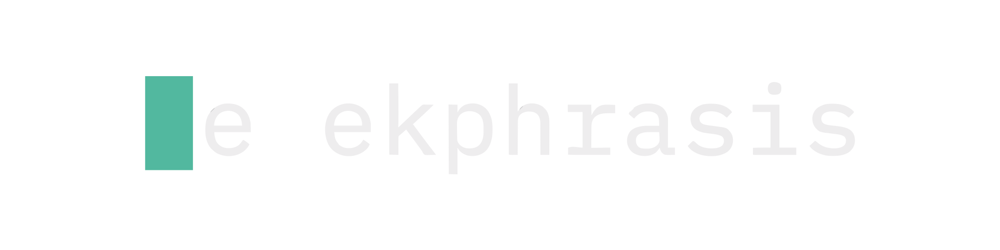

<p align="center">
  
</p>

A Tampermonkey userscript that adds a prompt studio panel to [NovelAI](https://novelai.net/image). Manage templates, placeholders, composition presets, and batch queues — all without leaving the page.

**Current version:** 4.0.0

---

## Installation

1. Install [Tampermonkey](https://www.tampermonkey.net/) for your browser
2. Click **[Install Ekphrasis](./ekphrasis.user.js)** — Tampermonkey will prompt automatically
3. Navigate to `https://novelai.net/image` — the panel will appear on the right

> **Manual install:** Open Tampermonkey dashboard → Create new script → paste contents of `ekphrasis.user.js`

---

## Features

### Templates
Save and reuse prompt snippets. Organize them with categories. Select one to preview it, then apply directly to the prompt field.

### Placeholders
Define named placeholder types (e.g. `artist`, `character`, `style`) and fill them with values. Use `{artist}` syntax in templates — the selected value gets substituted at apply time.

Multiple values can be selected to generate all combinations via the queue.

### Negative Templates
Create and manage a separate library of negative prompts. Link each positive template to a specific negative template via the Edit modal — the positive template will then show a red **N** badge. Use the **Pos+Neg** button to apply both at once. Links are stored by stable template ID, so deleting one negative template no longer shifts unrelated references.

### Quality Tags
Strip **🏷️** di footer — pilih model (V4.5 Full, V4.5 Cur, V4 Full, V4 Cur, V3) lalu klik **+ Insert Quality Tags** untuk append quality tags yang sesuai langsung ke prompt NAI.

### T5 Token Counter
Badge `~N/512` di footer bar Quality strip menampilkan perkiraan jumlah T5 token dari prompt NAI saat ini secara realtime. Hijau ≤400, kuning 401–480, merah >480.

### Anlas Calculator
Strip **💎** di footer — hitung estimasi biaya Anlas per generasi:
- **Opus Plan** toggle — V4.5 Full = 0 Anlas base saat aktif
- **Precise Ref** spinner — tiap reference +5 Anlas
- **Vibe Transfer** spinner — 4 pertama gratis, ke-5+ +2 Anlas masing-masing
- Badge live `N Anlas` di footer bar (hijau / kuning / merah)

### Composition (Framing)
Quick-pick buttons for shot distance, camera angle, body focus, and pose. Click to toggle a tag directly into the prompt.

### Batch Queue
Generate permutations of templates × placeholder combinations automatically. Supports delay between generations to avoid rate limiting.

**Batch Raw Import** — klik 📋 di queue bar untuk paste banyak prompt sekaligus tanpa perlu template. Pisahkan tiap prompt dengan `---`:

```
a cute fox, masterpiece
---
wolf in forest, best quality
---
dragon, cinematic lighting
→ 3 items langsung masuk queue
```

### Weight Syntax
| Syntax | Effect |
|---|---|
| `1.5::tag::` | V4.5 — stronger emphasis |
| `0.8::tag::` | V4.5 — weaker emphasis |
| `-0.5::tag::` | V4.5 — suppress |
| `{tag}` | Legacy boost (×1.05 per brace) |
| `[tag]` | Legacy weaken (÷1.05 per bracket) |

### Randomizer
Use `||opt1|opt2|opt3||` in a template. At queue time, Ekphrasis expands every variant into separate queue entries.

```
||red|blue|green|| hair, ||smiling|neutral|| expression
→ 6 combinations generated
```

### Negative Prompt
Apply a negative prompt alongside the main prompt using the **Both** button. Negative templates can be linked to positive templates.

---

## Storage Documents

Data is mirrored into three v4 documents via Tampermonkey's `GM_getValue`/`GM_setValue`:

| Key | Maps to | Content |
|---|---|---|
| `ekphrasis.library.v4` | `library.json` | Unified templates, placeholders, and categories |
| `ekphrasis.settings.v4` | `settings.json` | Queue/model/anlas preferences plus Studio-only flags |
| `ekphrasis.session.v4` | `session.json` | Last-used template and resumable queue state |

Legacy `nai_ext_*` keys are read once and migrated in place on first run. Export now writes `library.json` directly, and import accepts full v4 libraries, partial v4 bundles, or legacy v3 exports.

---

## Model-Specific Tags

| Tag | Description | Model |
|---|---|---|
| `fur dataset` | Furry art mode | V4+ |
| `background dataset` | No-character mode | V4.5+ |
| `rating:general` | Content rating | V4+ |
| `year XXXX` | Era-specific style | V3+ |

### Quality Tags by Model

| Model | Quality Tags |
|---|---|
| V4.5 Full | `location, very aesthetic, masterpiece, no text` |
| V4.5 Curated | `location, masterpiece, no text, -0.8::feet::, rating:general` |
| V4 Full | `no text, best quality, very aesthetic, absurdres` |
| V4 Curated | `amazing quality, very aesthetic, absurdres` |
| V3 | `best quality, amazing quality, very aesthetic, absurdres` |

### Anlas Costs (key extras)

| Fitur | Biaya |
|---|---|
| Vibe Transfer ke-5+ | +2 Anlas per vibe per image |
| Precise Reference | +5 Anlas per reference per image |
| V4.5 Full (Opus plan) | **0 Anlas** (gratis dalam kondisi normal) |

---

## Files

| File | Purpose |
|---|---|
| `ekphrasis.user.js` | The userscript (single file, install this) |
| `index.html` | Landing/install page |
| `assets/images/logo1.svg` | Square icon mark |
| `assets/images/logo3.svg` | Full `▌ekphrasis` wordmark (primary logo) |
| `CHANGELOG.md` | Version history |
| `ROADMAP.md` | Planned features |
| `todo.md` | Active development tasks |
